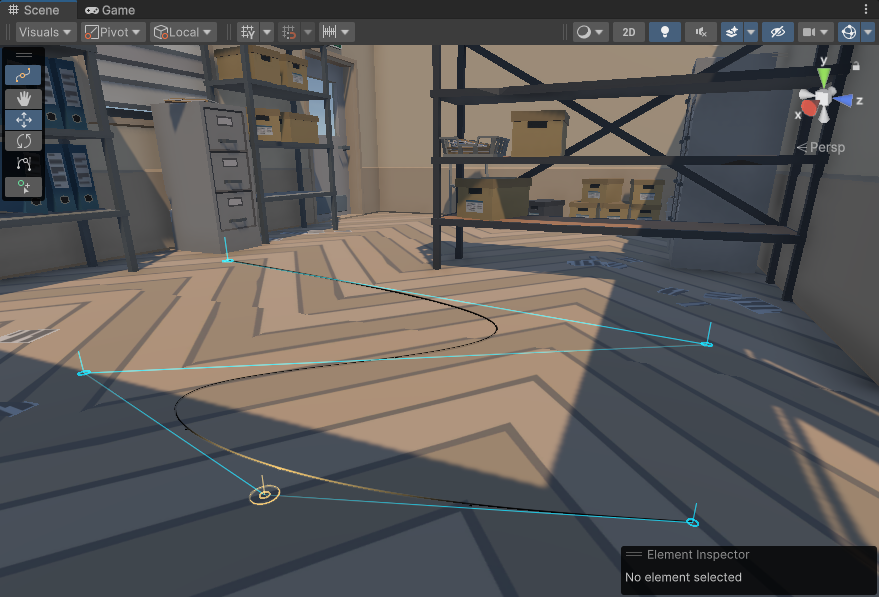

# About

Based on [`com.unity.splines`](https://docs.unity3d.com/Packages/com.unity.splines@2.2/manual/index.html) version 2.2.1.

The original package provides linear, cubic Bézier, and Catmull-Rom splines. They are not [C^2-continuous](https://www.youtube.com/watch?v=jvPPXbo87ds).

This fork provides uniform cubic B-Splines (`bsplines` branch).

See also [`com.not-unity.yuksel-splines`](https://github.com/Ohmnivore/com.not-unity.yuksel-splines) for another C^2 option.

## Note
Only B-Splines are supported in this package. Support of all other types has been removed for simplicity, although this package can be installed side by side with the original.

# Installation
* Install the package [from its git URL](https://docs.unity3d.com/Manual/upm-ui-giturl.html) or [from a local copy](https://docs.unity3d.com/Manual/upm-ui-local.html).
* It does not depend on the `com.unity.splines` package and will not conflict with it if it's present

# Beyond B-Splines
B-Splines are non-interpolating which makes the authoring of normals and links fairly challenging (see "Spline Normals" and "Spline Links" sections).

These problems combined make this fork a failed experiment for many (but not all) use cases. We are hitting the limit of what's possible with B-splines.

Taking a step back then, an ideal spline for us should have the following properties:

* C^2 continuity
* Interpolating
* Local support (~4 points)
* Doesn't need global optimization
* Good to have: Supports linear segments
* Good to have: Supports perfectly circular segments
* Good to have: Doesn't introduce any self-intersections

[Cem Yuksel's class of C^2 interpolating splines](http://www.cemyuksel.com/research/interpolating_splines/a_class_of_c2_interpolating_splines.pdf) seem like an excellent candidate: https://github.com/Ohmnivore/com.not-unity.yuksel-splines.

# Possible Improvements
* Reimplement with Yuksel splines
* Curve interpolation (global or local with higher degree B-Splines)
* Arbitrary B-Spline degree
* Twist angles/vectors for normals along the spline (see "Spline Normals")
* Better spline links (see "Spline Links")
* Shared interfaces with `com.unity.splines`
* Shader utility functions have not been reimplemented for B-Splines
* Automated tests have not been reimplemented for B-Splines
* B-Splines and other types of splines co-existing in one package

# Implementation Details
For open splines, the control points are mirrored to ensure that the spline passes through its first and last points (unlike Bézier which gets away with simple clamping). For closed splines, the control points are wrapped to ensure continuity (same as Bézier).

Derivatives are analytical and need only be applied to the parameter vector `[1, t, t^2, t^3]`. This vector becomes `[0, 1, 2t, 3t^2]` for the tangent and `[0, 0, 2, 6t]` for the acceleration.

The multiplication of the control point vector by the basis function matrix could maybe be cached for every `BSplineCurve`, and  re-used for position and derivative computations. This is not done at the moment.

## Changes
### BezierKnot -> ControlPoint
The `BezierKnot` has been replaced by the `ControlPoint`. Major differences are:

* No more concept of tangents or rotation
* The spline doesn't necessarily pass through every control point

Some of the API and comments still refer to knots. This should be interpreted as control points, not B-Spline basis knots (which are uniform and constant in this package).

### BezierCurve -> BSplineCurve
A cubic B-Spline is affected by at most 4 control points at any given location. This fact along with our constant knot vector allows us to evaluate a spline in segments for each control point using the `BSplineCurve` structure.

### Finding adjacent control points
Because of open spline clamping through point mirroring, it's no longer correct to resolve adjacent control points by incrementing/decrementing a control point index.

The new `Spline.GetCurveControlPointsForIndex`, `Spline.GetCurveForControlPoint`, and `ISpline.GetCurveControlPoints` functions abstract the clamping and wrapping logic and should be used instead.

# Spline Normals
Due to time constraints and no obvious solution, spline normals have not been implemented at all.

# Spline Links
Linking the endpoints of open splines together works as expected. In any other combination the splines might not meet, since control points usually wouldn't be located on the splines.
